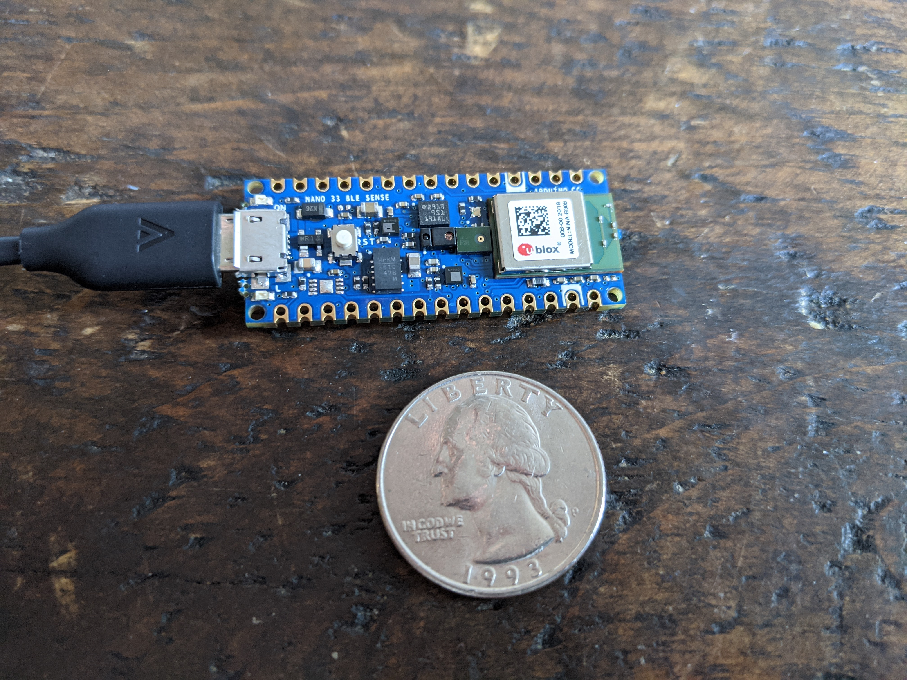

# MicrocontrollerRecognizer
My thesis concerns deploying a *tiny* text-independent speaker verification model onto an edge device, specifically the [Arduino Nano 33 BLE](https://store.arduino.cc/usa/nano-33-ble). 

The models are trained using log-mel spectrograms, generated by [`librosa`](https://librosa.org/doc/latest/generated/librosa.feature.melspectrogram.html), from a `tf.Dataset` over the [LibriSpeech](http://www.openslr.org/12/), [VoxCeleb1](https://www.robots.ox.ac.uk/~vgg/data/voxceleb/), and [CommonVoice](https://commonvoice.mozilla.org/en/datasets) datasets. They were then validated on the `test-*` datasets in `LibriSpeech` and all of [VCTK](https://datashare.is.ed.ac.uk/handle/10283/3443). Here, we've trained the models using `tensorflow` v2.3.

All of the code relevant to training and serializing the models in `tensorflow` can be found in the [`tensorflow`](./tensorflow) directory.

Those models are then converted to `tf.lite.micro` models and deployed onto an Arduino device which uses the code in [`MicrocontrollerRecognizer`](./MicrocontrollerRecognizer).

Further testing of the `C++` re-production of the feature engineering steps mentioned above from `librosa` can be found in the [`cpp`](./cpp) directory.

For more discussion, you can find several PDF versions of Jupyter Notebooks in the [`notebooks`](./notebooks) directory discussing the work in detail. The final, submitted, thesis paper and its assets are located in [`thesis-paper`](./thesis-paper). 

## Models
In training, the models final layer is a custom defined `SpeakerSimilarityMatrixLayer`, 
```python
class SpeakerSimilarityMatrixLayer(tf.keras.layers.Layer):

    def __init__(self, n_speakers, utterances_per_speaker, embedding_length):
        super(SpeakerSimilarityMatrixLayer, self).__init__()
        self.W = tf.Variable(name='W', trainable=True, initial_value=10.)
        self.b = tf.Variable(name='b', trainable=True, initial_value=-5.)
        self.N = n_speakers
        self.M = utterances_per_speaker
        self.P = embedding_length

    def call(self, inputs):
        """
        Args:
            inputs: output from the final Dense(self.P) embedding layer, representing each
                    speakers "voiceprint" for a given utterance.
        Returns:
            An [NM x N] cosine similarity matrix comparing the NM utterances in each column
            to the N centroids (representing the averaged embedding for a given speaker).
        """
        # [n_speakers x utterances x embedding_length]
        inputs = tf.math.l2_normalize(inputs, axis=1)
        utterance_embeddings = tf.reshape(inputs, shape=[self.N, self.M, self.P])

        # the averaged embeddings for each speaker: [n_speakers x embedding_length]
        centroids = tf.math.l2_normalize(
            tf.reduce_mean(utterance_embeddings, axis=1),
            axis=1
        )
        # now we need every utterance_embedding's cosine similarity with those centroids
        # returning: [n_speakers * utterances x n_speakers (or n_centroids)]
        S = tf.concat(
            [tf.matmul(utterance_embeddings[i], centroids, transpose_b=True) for i in range(self.N)],
            axis=0
        )
        return tf.abs(self.W) * S + self.b
```
which is responsible for taking all the embedding vectors which are outputs of the upstream `Dense` layer 
and generating an $[NM,N]$ cosine similarity matrix over which the loss is computed. This approach is motivated
by Wan, Wang, Papir, and Lopez-Moreno (2017) [Generalized End-to-End Loss](https://arxiv.org/abs/1710.10467). Once 
the model is trained, a speaker is _enrolled_ by taking the average of several (up to you) embedding vectors, which are 
the `Dense` layer right before our `SpeakerSimilarityMatrixLayer`, representing utterances which belong to them. 

Trained, frozen models can be found in [`tensorflow/frozen_models`](./tensorflow/frozen_models). The 4 sub-directories contain:

| Subdirectory | Contents                                     |
| :----------- | :--------------------------------------------|
| `confs`      | Configs for each serialized model's training |
| `embedding`  | Models which output an utterance's embedding |
| `full`       | Models which output the `SpeakerSimilarityMatrixLayer` output|
| `tiny`       | TensorflowLite Micro models | 

## Deployment
Deploying the models as `TensorflowLite` objects onto Arduino requires us to essentially re-implement the feature engineering steps which `librosa` provides in `C/C++`. For example, we defined a `FeatureProvider` object which can generate log-mel spectograms for a buffer representing the amplitude of our waveform:
```cpp
enum FeatureStatus {
    ready = 0,
    error = 1
};

class FeatureProvider {

    public:

        FeatureProvider(
            size_t waveform_length,
            float* waveform_data,
            int win_length,
            int hop_length,
            int n_filter,
            int sr, 
            int n_fft,
            int n_frame
        )   : waveform_length(waveform_length),
            waveform_data(waveform_data),
            sr(sr),
            n_filter(n_filter),
            n_fft(n_fft),
            nfft_real(n_fft / 2 + 1),
            win_length(win_length),
            hop_length(hop_length),
            n_frame(n_frame) {

            // allocate the block for raw waveform data
            for (size_t i = 0; i < waveform_length; i++) waveform_data[i] = 0;

            // allocate the re-usable filter bank block
            fb = new float*[n_filter]; // [n_filter, nfft / 2 + 1]
            for (int i = 0; i < n_filter; i++) fb[i] = new float[nfft_real]; 
            filter_bank(fb, n_filter, sr, n_fft);
            // allocate all the temporary computation blocks
            frames = new float*[n_frame]; // [n_frame, nfft]
            for (int i = 0; i < n_frame; i++) frames[i] = new float[n_fft]; 

            stft_frames = new Complex*[n_frame]; // [n_frame, nfft / 2 + 1]
            for (int i = 0; i < n_frame; i++) stft_frames[i] = new Complex[nfft_real];
            
            energies = new float*[n_frame]; // [n_frame, nfft / 2 + 1]
            for (int i = 0; i < n_frame; i++) energies[i] = new float[nfft_real];
            
            transposed = new float*[nfft_real]; // [nfft / 2 + 1, n_frame]
            for (int i = 0; i < nfft_real; i++) transposed[i] = new float[n_frame];
        };

        FeatureStatus waveform_to_feature(float (&feature_buffer)[N_FILTER][N_FRAME]) {
            int nfft_real = n_fft / 2 + 1;
            frame();
            stft(stft_frames, frames, n_frame, n_fft);
            to_energy(energies, stft_frames, n_frame, nfft_real);

            MatrixMath::transpose(transposed, energies, n_frame, nfft_real);
            MatrixMath::dot_product(feature_buffer, fb, transposed, n_filter, nfft_real, nfft_real, n_frame);

            log_magnitude(feature_buffer);

            return FeatureStatus(0);
        };
}
```
This, then, is instantiated in our `setup()` portion of our Arduino program,
```cpp
setup() {
    // ...
    static feature::FeatureProvider fp(waveform_length, raw_waveform_buffer, window_length, 
                                    hop_length, n_filter, signal_rate, nfft, num_frames);
    feature_provider = &fp;
    //...
}
```

and then gets used within our main Arduino process `loop()`,
```cpp

// assuming we have a global static buffer for our raw, collected, audio
loop() {
    if (is_buffer_full) {
    
        // convert Mic input to normalized waveform [-1, 1]
        feature::normalize_waveform(raw_waveform_buffer, waveform_length);
        feature_provider->waveform_to_feature(feature_buffer);
        for(int i = 0; i < n_filter; i++) {
            for(int j = 0; j < num_frames; j++) {
            model_input->data.f[i*n_filter + j] = feature_buffer[i][j];
            }
        }
        
        // call model to get embedding vector
        TfLiteStatus invoke_status = interpreter->Invoke();
        
        // get pointer to output tensor
        TfLiteTensor* output = interpreter->output(0);
        
        // compute cosine similarity with target embedding
        float similarity = MatrixMath::cosine_similarity(output->data.f, enrolled_embedding, embedding_len);
        
        // (optional) threshold to accept/reject
        Serial.println(similarity);

        raw_buffer_idx = 0;
        is_buffer_full = false;
    }
}
```
